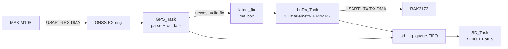

# Nose Cone GNSS & LoRa Telemetry Firmware

Firmware for the nose-cone GNSS receiver, RAK3172 LoRa P2P link, and microSD flight logger.

**Target:** STM32F411RET6 • FreeRTOS • MAX-M10S GNSS • RAK3172 • microSD over SDIO

## System at a glance

The firmware has three FreeRTOS tasks. DMA moves UART and SDIO data; interrupts remain short and notify the owning task. Tasks perform parsing, framing, logging, retry, and recovery work.

| Task        |       Priority | Responsibility                                                                                      |
| ----------- | -------------: | --------------------------------------------------------------------------------------------------- |
| `GPS_Task`  |        Highest | Drain and parse GNSS UART DMA data; publish the newest valid fix; submit GPS log records.           |
| `LoRa_Task` | Second-highest | Send fresh 1 Hz telemetry, service RAK3172 P2P receive/transmit state, and process ground commands. |
| `SD_Task`   |         Medium | Own SDIO/DMA and FatFs; drain the log FIFO.                                                         |

## Core data structures

| Structure          | Flow                               | Policy                                                                                    |
| ------------------ | ---------------------------------- | ----------------------------------------------------------------------------------------- |
| `latest_fix`       | `GPS_Task` → `LoRa_Task`           | Latest-value mailbox. A new fix replaces an older unconsumed fix.                         |
| `sd_log_queue`     | GPS/LoRa → SD                      | FIFO. Preserves log order; count drops if full.                                           |
| GNSS/LoRa RX rings | UART DMA → task                    | Circular byte buffers. ISR snapshots producer position and notifies the task.             |
| `ground_cmd_fifo`  | LoRa parser → LoRa command handler | Small FIFO of complete candidate commands; never use a latest-value mailbox for commands. |

The radio link sends the newest valid position at **1 Hz**. The task is event-driven rather than periodic: it wakes on its 1 Hz deadline, new-fix notification, UART/DMA event, receive-window deadline, or retry timeout.

## Key interfaces

| Interface       | Setting                                                          |
| --------------- | ---------------------------------------------------------------- |
| GNSS UART       | USART6, 9,600 bit/s, 8-N-1                                       |
| LoRa UART       | USART1, 115,200 bit/s, 8-N-1                                     |
| Radio mode      | RAK3172 LoRa P2P                                                 |
| Telemetry frame | 32-byte binary `GPS_FIX` frame, then hex encoded for `AT+PSEND=` |
| SD card         | SDIO/SDMMC 4-bit, FatFs                                          |

## Documentation

- [Architecture](docs/architecture.md) — data paths, task behavior, buffers, and scheduling.
- [Hardware interfaces](docs/hardware.md) — verified pinout and peripheral mapping.
- [Telemetry protocol](docs/protocol.md) — 32-byte frame, serialization, CRC, and commands.
- [Drivers](docs/drivers.md) — UART/DMA and SDIO/FatFs responsibilities.
- [LoRa P2P state machine](docs/lora-state-machine.md) — RAK3172 operation, timing, and receive behavior.
- [Fault handling](docs/fault-handling.md) — startup, degraded operation, and watchdog policy.
- [Test plan](docs/test-plan.md) — bring-up and acceptance checks.

## Important rules

- DMA transfers bytes; interrupts only acknowledge events, snapshot progress, and notify a task.
- No ISR parses NMEA, writes an SD card, transmits a radio command, or waits for hardware.
- A task may block on an RTOS notification, queue, semaphore, or timeout; it must not busy-wait.
- `LoRa_Task` exclusively owns RAK3172 UART buffers and AT-command sequencing.
- `SD_Task` exclusively calls FatFs.
