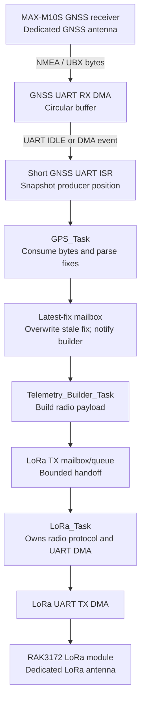

# Nose Cone GNSS & LoRa Telemetry Firmware

Firmware architecture for the nose-cone GNSS receiver and LoRa telemetry interface.

## Design summary

The firmware uses **FreeRTOS for application scheduling** and **bare-metal (self-configured) peripheral drivers**. Here, “bare metal” means the firmware owns the MCU UART, DMA/DMAMUX, GPIO, and NVIC configuration rather than depending on a high-level blocking UART driver. UART data movement uses DMA; interrupts only record progress and wake the appropriate task. No protocol parsing, logging, or blocking transmit is performed inside an interrupt service routine (ISR).

The GNSS receiver and LoRa radio have independent antennas and independent UARTs. Consequently, GNSS reception and LoRa transmission do not require antenna arbitration or a shared RF timing lock.



## Execution model

FreeRTOS schedules the application work. The drivers remain non-blocking: DMA performs byte movement, an ISR records progress, and the ISR wakes or notifies the waiting task using the ISR-safe FreeRTOS API.

| Task | Responsibility | Inputs |
|---|---|---|
| `GPS_Task` | Consume GNSS DMA bytes, parse NMEA/UBX, publish valid fixes | GNSS RX notification |
| `Telemetry_Builder_Task` | Copy the newest valid fix and build a telemetry frame | latest-fix notification |
| `LoRa_Task` | Own the RAK3172 protocol, ground-station messages, and UART RX/TX DMA | LoRa RX/TX notification; bounded TX mailbox/queue |
| `SD_Debug_Task` | Drain logs and provide non-critical debug/USB service | log queue; USB RX notification |

The idle task may enter a low-power mode when all application tasks are blocked.

### Proposed task priorities

These are initial relative priorities, not final numeric values. Confirm them with measured GNSS throughput, LoRa response deadlines, SD-card worst-case write latency, and the project's `configMAX_PRIORITIES` setting.

| Task | Relative priority | Rationale |
|---|---:|---|
| `GPS_Task` | 4| Must promptly drain the GNSS DMA ring so continuous serial data cannot overrun it. |
| `LoRa_Task` | 1 | Services radio responses and ground-station messages without delaying GNSS receive processing. |
| `Telemetry_Builder_Task` | 2 | Formats the newest fix, but does not own or wait on the UART transfer. |
| `SD_Debug_Task` | 3 | SD writes and debug traffic are non-critical and should yield to flight telemetry. |
| FreeRTOS idle task | 0 | Reclaims deleted-task memory if enabled and is the natural low-power idle point. |

Tasks should block on queues, direct-to-task notifications, or event groups rather than poll. In particular, `GPS_Task` should be notified whenever the RX DMA producer index advances.

### Interrupt ownership and behavior

| Interrupt source | Typical event | ISR responsibility | Task notified |
|---|---|---|---|
| GNSS UART | IDLE, error | Clear/report the event; snapshot the GNSS RX DMA producer position | `GPS_Task` |
| GNSS RX DMA | Half transfer, transfer complete, DMA error | Record buffer progress/error; optionally notify when no IDLE event is expected | `GPS_Task` |
| LoRa UART | IDLE, error | Clear/report the event; snapshot the LoRa RX DMA producer position | `LoRa_Task` |
| LoRa RX DMA | Half transfer, transfer complete, DMA error | Record buffer progress/error; notify the radio receive state machine | `LoRa_Task` |
| LoRa TX DMA / UART TC | DMA transfer complete; UART transmission complete | Mark the TX buffer available and advance the non-blocking TX state | `LoRa_Task` |
| GPS 1PPS (optional) | Rising edge | Capture a timer timestamp; do no serial parsing | Optional timing/diagnostic task |

UART IDLE is useful because it identifies a gap between received messages; DMA half/full-transfer interrupts are still useful as a safety mechanism when a stream has no idle gap. The precise set of enabled events depends on the MCU UART/DMA peripheral and configured data rate.

On Cortex-M, a **smaller numeric NVIC value means a higher hardware interrupt priority**. Any ISR that calls `xTaskNotifyFromISR()`, `xQueueSendFromISR()`, or another `...FromISR()` FreeRTOS API must be assigned an NVIC priority permitted by `configMAX_SYSCALL_INTERRUPT_PRIORITY`. Do not choose raw numeric NVIC priorities until that FreeRTOS configuration and the MCU's implemented priority bits are known.

## UART and DMA policy

### GNSS UART receive

GNSS output is continuous, so reception uses a DMA circular buffer.

1. Configure the UART receiver and its DMA request to write into a fixed RAM buffer.
2. Start DMA once in circular mode; do **not** restart it for every NMEA sentence.
3. On UART IDLE and/or DMA half-transfer/transfer-complete events, the ISR snapshots the DMA write position and sends an ISR-safe notification to `GPS_Task`.
4. `GPS_Task` consumes only the newly received byte range, handling circular-buffer wrap, and parses NMEA or UBX in task context.

The ISR must not parse NMEA, allocate memory, write an SD card, or enqueue a potentially blocking LoRa transmission.

### LoRa UART transmit

LoRa commands and telemetry payloads are sent with UART TX DMA.

1. `Telemetry_Builder_Task` copies the latest valid fix and formats a radio frame.
2. It posts that frame to the bounded LoRa TX mailbox/queue and returns; it never writes the UART or starts DMA directly.
3. `LoRa_Task` owns the UART, radio protocol state, and TX buffer. It starts TX DMA only when the UART and TX buffer are idle.
4. The DMA-complete/UART-TC ISR notifies `LoRa_Task`, which marks the buffer available and advances the non-blocking transmit state machine.

The TX buffer must remain unchanged until transmit completion. A queue of buffers, or ownership flag per buffer, prevents a new payload from overwriting an active DMA transfer.

### LoRa UART receive

Use RX DMA for the LoRa UART when the RAK3172 can emit responses or unsolicited events. The same circular-buffer and short-ISR pattern as the GNSS receiver applies. If the protocol is strictly request/response, a bounded DMA receive transaction may also be used, but it must have a timeout and recovery path.

## ISR rules

ISRs should be short and deterministic:

- acknowledge the peripheral/DMA event;
- snapshot the DMA producer index or completion status;
- update a `volatile` flag or ring-buffer index; and
- return.

Tasks own parsing, queue operations that are not ISR-safe, packet construction, SD writes, retry policies, and error reporting. Shared ISR/task state must be accessed atomically or inside a short critical section.

## GPS and LoRa handoff policy

The incoming GPS path intentionally does **not** queue every parsed fix. `GPS_Task` writes a latest-fix mailbox and sends a direct notification to `Telemetry_Builder_Task`:

```text
GPS_Task -> latest_fix mailbox (overwrite stale fix) -> notify builder -> build frame
```

This is a **latest-fix-wins** policy. If the builder is busy when several new fixes arrive, it processes the newest one rather than transmitting stale positions later. This is appropriate when current position is more valuable than delivery of every GNSS update.

The builder-to-LoRa boundary is separate:

```text
Telemetry_Builder_Task -> bounded LoRa TX mailbox/queue -> LoRa_Task -> UART TX DMA
```

The bounded handoff prevents the builder from overwriting a frame that the LoRa UART DMA is still sending. Define its full behavior explicitly: either replace a waiting unsent position with the newest frame (recommended for position telemetry), or count/drop the new frame. Never overwrite an active DMA TX buffer.

The latest-fix mailbox must be protected against a torn read. Use a short critical section, a mutex, or a version-counter/double-buffer scheme so the builder copies one coherent fix before constructing a packet.

## DMA and UART configuration checklist

- Enable peripheral, GPIO, DMA/DMAMUX, and interrupt-controller clocks.
- Configure UART pins, baud rate, word length, parity, stop bits, and RX/TX enable.
- Select the correct UART-to-DMA request mapping.
- Place DMA buffers in memory accessible to DMA and aligned as required by the MCU.
- Configure GNSS RX DMA as circular; configure LoRa TX DMA as normal mode per frame.
- Enable and prioritize UART IDLE/error and DMA completion interrupts.
- Clear stale UART error conditions and define recovery for overrun, framing, DMA, and radio-response timeouts.
- If the MCU has a data cache, perform the required cache maintenance around DMA buffers.

Using DMA does **not** mean the CPU does nothing: firmware still configures these peripherals, manages buffer ownership, and handles completion/error events. DMA simply moves UART bytes without a CPU interrupt for every byte.

## Logging and USB

GNSS, telemetry-builder, and LoRa work may publish log records into a separate log queue. `SD_Debug_Task` drains that queue using non-blocking or bounded operations. USB debug output must likewise be buffered or rate-limited so it cannot delay GNSS parsing or radio service.

## Non-goals and assumptions

- There is no shared GNSS/LoRa antenna and therefore no antenna switching logic.
- `GPS_TIMEPULSE` / 1PPS is optional and currently unassigned. It may later feed a timer capture input for precise timestamping; it is not required for UART GNSS parsing.
- RTOS queues and task notifications are used for application handoff; low-level drivers do not block waiting for UART bytes or transmit completion.

## Acceptance checks

- GNSS data remains loss-free at the configured output rate while LoRa transmissions and SD logging occur.
- UART ISRs perform no parsing or blocking I/O.
- DMA buffers are never modified before their transfer has completed.
- Queue overflow, UART errors, and LoRa timeouts are observable and recover without a reset.
- ISR-to-task notifications use only the ISR-safe FreeRTOS APIs and request a context switch when required.
