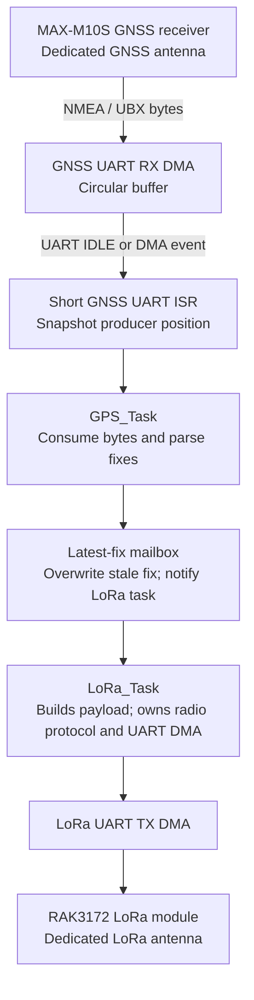
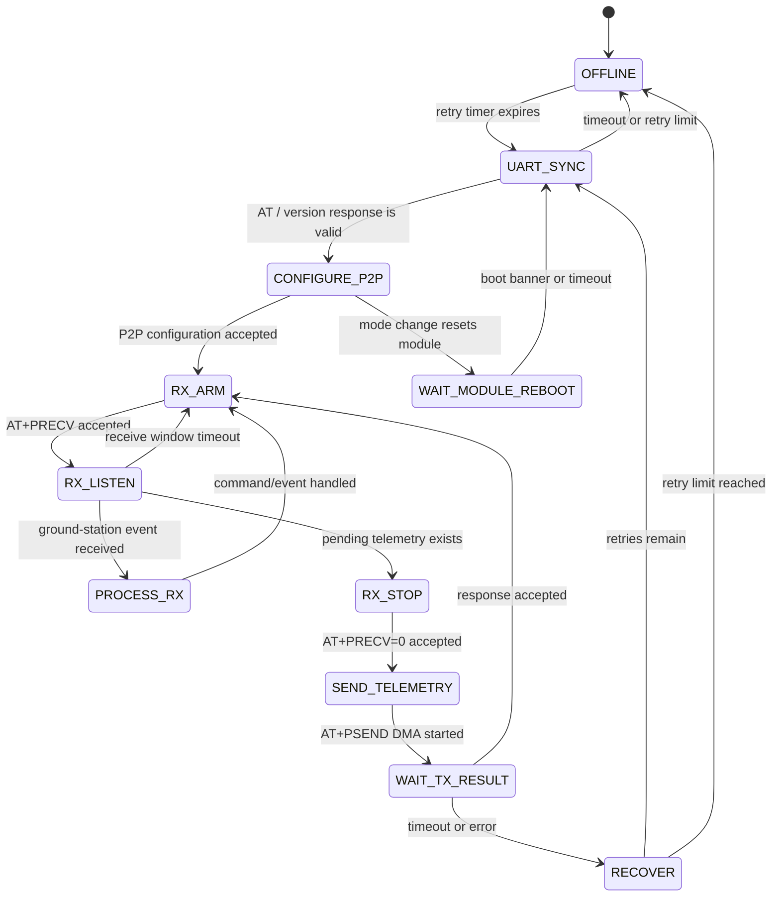

# Nose Cone GNSS & LoRa Telemetry Firmware

Firmware architecture for the nose-cone GNSS receiver and LoRa telemetry interface.

**Target MCU:** STM32F411RET6 (STM32F411xE family, LQFP64).

## Design summary

The firmware uses **FreeRTOS for application scheduling** and **bare-metal (self-configured) peripheral drivers**. Here, “bare metal” means the firmware owns the MCU UART, DMA stream/channel selection, GPIO, and NVIC configuration rather than depending on a high-level blocking UART driver. UART data movement uses DMA; interrupts only record progress and wake the appropriate task. No protocol parsing, logging, or blocking transmit is performed inside an interrupt service routine (ISR).

The GNSS receiver and LoRa radio have independent antennas and independent UARTs. Consequently, GNSS reception and LoRa transmission do not require antenna arbitration or a shared RF timing lock.

### Confirmed interface settings

| Interface | Setting | Value |
|---|---|---|
| GNSS UART | Baud rate | 9,600 bit/s |
| RAK3172 LoRa UART | Baud rate | 115,200 bit/s |
| RAK3172 network mode | Radio mode | LoRa P2P |
| Telemetry payload/framing format | Definition | Version 1 binary `GPS_FIX` frame (34 bytes) |
| SD log record/file format | Definition | **TBD** |

Unless the module datasheets specify otherwise, validate 8 data bits, no parity, and 1 stop bit (8-N-1) during board bring-up.



## Execution model

FreeRTOS schedules the application work. The drivers remain non-blocking: DMA performs byte movement, an ISR records progress, and the ISR wakes or notifies the waiting task using the ISR-safe FreeRTOS API.

| Task | Responsibility | Inputs |
|---|---|---|
| `GPS_Task` | Consume GNSS DMA bytes, parse NMEA/UBX, publish the newest valid fix, and submit GPS log records | GNSS RX notification |
| `LoRa_Task` | Copy the newest fix, build the telemetry frame, own the RAK3172 P2P protocol and UART RX/TX DMA, and process ground-station messages | latest-fix notification; LoRa RX/TX notification |
| `SD_Task` | Drain the shared log FIFO and write records through FatFs | log FIFO |

The idle task may enter a low-power mode when all application tasks are blocked.

### Proposed task priorities

These are initial relative priorities, not final numeric values. Confirm them with measured GNSS throughput, LoRa response deadlines, SD-card worst-case write latency, and the project's `configMAX_PRIORITIES` setting.

| Task | Relative priority | Rationale |
|---|---:|---|
| `GPS_Task` | Highest | Must promptly drain the GNSS DMA ring so continuous serial data cannot overrun it. |
| `LoRa_Task` | Second-highest | Safety-critical communications: builds telemetry, services radio responses/ground-station messages, and recovers the radio link without delaying GNSS receive processing. |
| `SD_Task` | Medium | Drains the log FIFO and performs SDMMC DMA work, but logging must yield to GNSS and communications. |
| FreeRTOS idle task | Lowest | Reclaims deleted-task memory if enabled and is the natural low-power idle point. |

`LoRa_Task` must remain non-blocking at its elevated priority: use UART DMA, direct-to-task notifications, finite AT-command deadlines, and bounded parsing work. `SD_Task` must use SDMMC DMA, write bounded batches, and block on completion; FatFs/card erase latency must never delay GNSS or communications. The GPS DMA ring and high-priority `GPS_Task` remain the protection against GNSS data loss.

Tasks should block on queues, direct-to-task notifications, or event groups rather than poll. In particular, `GPS_Task` should be notified whenever the RX DMA producer index advances.

### Interrupt ownership and behavior

| Interrupt source | Typical event | ISR responsibility | Task notified |
|---|---|---|---|
| GNSS UART | IDLE, error | Clear/report the event; snapshot the GNSS RX DMA producer position | `GPS_Task` |
| GNSS RX DMA | Half transfer, transfer complete, DMA error | Record buffer progress/error; optionally notify when no IDLE event is expected | `GPS_Task` |
| LoRa UART | IDLE, error | Clear/report the event; snapshot the LoRa RX DMA producer position | `LoRa_Task` |
| LoRa RX DMA | Half transfer, transfer complete, DMA error | Record buffer progress/error; notify the radio receive state machine | `LoRa_Task` |
| LoRa TX DMA / UART TC | DMA transfer complete; UART transmission complete | Mark the TX buffer available and advance the non-blocking TX state | `LoRa_Task` |
| GPS 1PPS (optional) | Rising edge | Capture a timer timestamp; do no serial parsing | Optional timing/diagnostic task |

UART IDLE is useful because it identifies a gap between received messages; DMA half/full-transfer interrupts are still useful as a safety mechanism when a stream has no idle gap. The precise set of enabled events depends on the MCU UART/DMA peripheral and configured data rate.

On Cortex-M, a **smaller numeric NVIC value means a higher hardware interrupt priority**. Any ISR that calls `xTaskNotifyFromISR()`, `xQueueSendFromISR()`, or another `...FromISR()` FreeRTOS API must be assigned an NVIC priority permitted by `configMAX_SYSCALL_INTERRUPT_PRIORITY`. Do not choose raw numeric NVIC priorities until that FreeRTOS configuration and the MCU's implemented priority bits are known.

## UART and DMA policy

### GNSS UART receive

GNSS output is continuous, so reception uses a DMA circular buffer.

1. Configure the UART receiver and its DMA request to write into a fixed RAM buffer.
2. Start DMA once in circular mode; do **not** restart it for every NMEA sentence.
3. On UART IDLE and/or DMA half-transfer/transfer-complete events, the ISR snapshots the DMA write position and sends an ISR-safe notification to `GPS_Task`.
4. `GPS_Task` consumes only the newly received byte range, handling circular-buffer wrap, and parses NMEA or UBX in task context.

The ISR must not parse NMEA, allocate memory, write an SD card, or enqueue a potentially blocking LoRa transmission.

### LoRa UART transmit

LoRa commands and telemetry payloads are sent with UART TX DMA.

1. `LoRa_Task` is notified when `GPS_Task` publishes a valid fix, then copies the newest coherent mailbox value.
2. `LoRa_Task` encodes the binary telemetry frame, wraps it in the RAK3172 `AT+PSEND=<hex>` command, and owns the UART, radio state, and TX buffer.
3. It starts TX DMA only when the UART and active TX buffer are idle.
4. The DMA-complete/UART-TC ISR notifies `LoRa_Task`, which marks the buffer available and advances the non-blocking transmit state machine.

The TX buffer must remain unchanged until transmit completion. A queue of buffers, or ownership flag per buffer, prevents a new payload from overwriting an active DMA transfer.

### LoRa UART receive

Use RX DMA for the LoRa UART when the RAK3172 can emit responses or unsolicited events. The same circular-buffer and short-ISR pattern as the GNSS receiver applies. If the protocol is strictly request/response, a bounded DMA receive transaction may also be used, but it must have a timeout and recovery path.

## ISR rules

ISRs should be short and deterministic:

- acknowledge the peripheral/DMA event;
- snapshot the DMA producer index or completion status;
- update a `volatile` flag or ring-buffer index; and
- return.

Tasks own parsing, queue operations that are not ISR-safe, packet construction, SD writes, retry policies, and error reporting. Shared ISR/task state must be accessed atomically or inside a short critical section.

## GPS-to-LoRa handoff policy

The incoming GPS path intentionally does **not** queue every parsed fix. `GPS_Task` writes a latest-fix mailbox and sends a direct notification to `LoRa_Task`:

```text
GPS_Task -> latest_fix mailbox (overwrite stale fix) -> notify LoRa_Task -> build and transmit frame
```

This is a **latest-fix-wins** policy. If LoRa is busy when several new fixes arrive, it processes the newest one rather than transmitting stale positions later. This is appropriate when current position is more valuable than delivery of every GNSS update.

The latest-fix mailbox must be protected against a torn read. Use a short critical section, a mutex, or a version-counter/double-buffer scheme so `LoRa_Task` copies one coherent fix before constructing a packet. `LoRa_Task` owns its private active UART-DMA TX buffer; no other task may modify it.

## Driver ownership and implementation checklist

Each driver has one primary owner. This prevents multiple tasks from modifying the same peripheral state or DMA buffer.

| Component to implement | Primary owner | Required behavior |
|---|---|---|
| Board clocks, GPIO alternate functions, NVIC priorities, and DMA stream/channel selection | board initialization | Configure shared MCU infrastructure before the scheduler starts. |
| GNSS UART RX circular-DMA driver, IDLE/error ISR | `GPS_Task` | Move continuous receiver bytes into the GNSS ring; notify the task without parsing in the ISR. |
| NMEA/UBX parser and latest-fix publisher | `GPS_Task` | Validate messages, publish one coherent newest fix, and notify `LoRa_Task`. |
| Telemetry frame encoder | `LoRa_Task` | Copy the latest fix and create a self-contained radio frame before radio transmission. |
| RAK3172 protocol/state machine and reset/boot control | `LoRa_Task` | Own command/response handling, receive events from the ground station, retries, timeouts, and module recovery through reset/boot pins. |
| LoRa UART RX DMA, TX DMA, and completion/error ISRs | `LoRa_Task` | Own UART state and all active TX/RX DMA buffers. |
| SDMMC/SDIO 4-bit block driver and DMA completion/error ISR | `SD_Task` | Initialize the card and transfer blocks without busy-waiting. |
| FatFs `diskio` glue, file creation, writes, sync, and log rotation | `SD_Task` | Be the only task that calls FatFs. |
| Shared logging API | all producer tasks; `SD_Task` consumer | Copy bounded log records into the SD log FIFO. |
| Optional USB CDC/debug buffering | optional diagnostic service | Keep console service outside the three flight tasks, or remove it from the flight build. |

### Required driver layers

The two main hardware data-plane drivers to implement are the **UART/DMA driver** and the **SDMMC/SDIO + DMA driver**. They share the same supporting board configuration: clocks, GPIO alternate functions, DMA stream/channel selection, and NVIC interrupt configuration.

The STM32F411RET6 does **not** have a DMAMUX peripheral. Each DMA stream selects one of its supported peripheral requests using the `CHSEL[2:0]` field in `DMA_SxCR`; the legal DMA controller/stream/channel combinations must be taken from the STM32F411 reference manual. Allocate non-conflicting streams for GNSS UART RX, LoRa UART RX, LoRa UART TX, and SDIO DMA before implementation.

#### UART/DMA driver

Use one reusable UART/DMA driver implementation with a separate configuration instance for the GNSS UART and the LoRa UART. Each instance configures the UART registers, GPIO alternate functions, RX circular-DMA buffer, TX DMA transfers, UART IDLE/error interrupt, DMA completion/error interrupt, and ISR-safe task notification.

`GPS_Task` owns the GNSS instance. `LoRa_Task` owns the LoRa instance; it also implements the higher-level RAK3172 command/response and ground-station-message protocol above the UART driver.

#### SDMMC/SDIO + DMA driver

`SD_Task` owns the microSD driver. It configures the six SDMMC pins below, initializes the card in 1-bit mode, changes to 4-bit mode after initialization, sends SD-card commands, and starts/handles DMA block reads and writes.

```text
PC12  -> SD_CLK
PD2   -> SD_CMD
PC8   -> SD_DAT0
PC9   -> SD_DAT1
PC10  -> SD_DAT2
PC11  -> SD_DAT3
```

The SDMMC driver exposes bounded block operations such as `sd_read_blocks()` and `sd_write_blocks()`. FatFs is not the physical card driver: it is the filesystem layer above the driver. A small FatFs `diskio` adapter translates FatFs sector read/write requests into these SDMMC block operations.

```text
SD_Task -> FatFs -> diskio adapter -> SDMMC/SDIO + DMA driver -> microSD card
```

#### What is not an additional custom driver

- FatFs manages files and directories; it is a library plus a thin `diskio` adapter, not an SD-card hardware driver.
- The RAK3172 protocol state machine is an application-layer module on top of the LoRa UART driver, not a second UART driver.
- FreeRTOS supplies task scheduling and synchronization; the project configures its port and interrupt priorities but does not need to write a scheduler.
- A timer-capture/EXTI driver is needed only if the optional GPS 1PPS signal is used. USB support is likewise optional.

## Inter-task mailboxes and FIFOs

| Structure | Producer → consumer | Type | Capacity and full behavior |
|---|---|---|---|
| `latest_fix` | `GPS_Task` → `LoRa_Task` | Latest-value mailbox + direct task notification | One coherent fix structure; use a double buffer or version counter. A new fix overwrites an unconsumed older fix. |
| GNSS RX DMA ring | GNSS UART DMA → `GPS_Task` | Circular byte ring | **1,024 bytes**, about 1.07 s of continuous serial data at 9,600 bit/s. |
| LoRa RX DMA ring | LoRa UART DMA → `LoRa_Task` | Circular byte ring | **1,024 bytes**, about 89 ms at 115,200 bit/s; tune against the longest expected RAK3172 response/event. |
| `lora_active_tx` | `LoRa_Task` only | Private DMA buffer; **not** a queue | One active UART command buffer, initially **544 bytes**. A 255-byte binary payload is hex-encoded for `AT+PSEND=`, requiring up to 521 serial characters including command prefix and line ending. Never modify it until DMA and UART transmission completion. |
| `sd_log_queue` | GPS and LoRa tasks → `SD_Task` | Fixed-size FIFO | Initially **32 × 128-byte records** (4 KiB). Preserve record ordering; on full, increment a drop counter and apply the documented log-drop policy. |
| SD block staging buffers | `SD_Task` only | Private DMA buffers | At least **two 512-byte sector buffers**; use a larger aggregation buffer later if log throughput requires it. |

The stated capacities are safe initial integration values, not protocol limits. Confirm them using the actual maximum GNSS sentence size, RAK3172 response length, telemetry frame definition, logging rate, and worst-case SD-card write latency. `latest_fix` is intentionally not a FIFO: transmitting the newest position is normally more valuable than transmitting a sequence of stale positions. If the design later has must-deliver messages—such as deployment, fault, or configuration events—add a separate small FIFO for those messages rather than mixing them with replaceable position telemetry.

## Telemetry wire format

`LoRa_Task` converts the newest `gps_fix_t` mailbox value into this version-1 binary P2P frame, then hex-encodes the completed 32-byte frame for the RAK3172 `AT+PSEND=<hex>` command. The binary frame is only 32 bytes, approximately 13% of the RAK3172's 255-byte P2P payload limit.

### `gps_fix_t` payload — 25 bytes

The payload is derived from NMEA GGA (UTC time, latitude, longitude, fix quality, satellites, HDOP, altitude) and VTG (course and speed).

| Field | Type | Bytes | Scaling | Notes / range |
|---|---:|---:|---|---|
| `timestamp_epoch` | `uint32_t` | 4 | Unix epoch, seconds | Upstream system-clock stamp. |
| `nmea_time_utc` | `uint32_t` | 4 | centiseconds since UTC midnight | Parsed from GGA `hhmmss.ss`; 0–8,639,999. |
| `latitude` | `int32_t` | 4 | degrees × 10⁷ | ±90°, approximately 1.1 cm resolution. |
| `longitude` | `int32_t` | 4 | degrees × 10⁷ | ±180°, approximately 1.1 cm resolution. |
| `altitude_msl` | `int16_t` | 2 | meters × 10 | ±3,276.7 m, decimeter resolution. |
| `fix_quality` | `uint8_t` | 1 | enum 0–6 | GGA field. |
| `num_sats` | `uint8_t` | 1 | count | GGA field. |
| `hdop` | `uint8_t` | 1 | ×10 | 0.0–25.5; clamp larger values. |
| `course` | `uint16_t` | 2 | degrees ×10 | 0–359.9°, from VTG. |
| `speed` | `uint16_t` | 2 | m/s ×100 | 0–655.35 m/s, from VTG. |

### `telemetry_frame_t` — 32 bytes

| Field | Type | Bytes | Purpose |
|---|---:|---:|---|
| `sync` | 2 × `uint8_t` | 2 | Literal `0xAA`, `0x55` frame-start marker; endian-independent. |
| `version` | `uint8_t` | 1 | Payload layout version; `0x00` is reserved as invalid/unset. |
| `msg_type` | `uint8_t` | 1 | `0x01` = `GPS_FIX`; reserve other values for future frame kinds. |
| `seq_num` | `uint8_t` | 1 | Rolling 0–255 counter for ground-side dropped-frame detection. |
| `payload` | `gps_fix_t` | 25 | GPS payload defined above. |
| `checksum` | `uint16_t` | 2 | CRC16-CCITT over `version` through the final payload byte; excludes `sync`. |

**Important:** Do not transmit a C struct's raw in-memory representation. Serialize fields explicitly in the documented order. This avoids compiler padding and makes the frame portable. The team must choose and document one byte order for all multi-byte fields; **big-endian/network order is recommended**. The exact CRC16-CCITT variant must also be locked down in code and ground-side tests (recommended: poly `0x1021`, init `0xFFFF`, no reflection, xorout `0x0000`).

`seq_num` increments once per completed telemetry-frame build and naturally wraps from 255 to 0. The ground station should verify the sync bytes, version/type, expected payload length, and CRC before accepting a frame.

> **Size check:** the specified fields total **32 bytes**, not 34: 2-byte sync + 3 bytes (`version`, `msg_type`, `seq_num`) + 25-byte payload + 2-byte CRC = 32. This README uses 32 bytes; add two explicitly named fields only if a 34-byte frame is intended.

## Pinout and hardware interfaces

The schematic is the electrical source of truth. This table is an implementation summary for firmware. Pins not yet verified against the schematic remain **TBD** and must not be guessed during driver implementation.

| Function | MCU pin | Peripheral / mode | Primary owner | Notes |
|---|---|---|---|---|
| `SD_CLK` | `PC12` | SDMMC/SDIO clock | `SD_Task` | MicroSD native interface. |
| `SD_CMD` | `PD2` | SDMMC/SDIO command | `SD_Task` | Requires the board's specified pull-up. |
| `SD_DAT0` | `PC8` | SDMMC/SDIO data 0 | `SD_Task` | Used during initialization and 4-bit operation. |
| `SD_DAT1` | `PC9` | SDMMC/SDIO data 1 | `SD_Task` | Required for 4-bit operation. |
| `SD_DAT2` | `PC10` | SDMMC/SDIO data 2 | `SD_Task` | Required for 4-bit operation. |
| `SD_DAT3` | `PC11` | SDMMC/SDIO data 3 | `SD_Task` | Required for 4-bit operation. |
| MCU GNSS TX | `PC6` (pin 37) | `USART6_TX`, AF8 | `GPS_Task` | 9,600 bit/s; connect to the GNSS receiver's RX. |
| MCU GNSS RX | `PC7` (pin 38) | `USART6_RX`, AF8 + RX DMA | `GPS_Task` | 9,600 bit/s; connect to the GNSS receiver's TX. |
| GNSS 1PPS | `PA5` (pin 21) | Timer capture or EXTI | optional timing service | Not required for UART parsing. |
| GNSS reset | `PA8` (pin 41) | GPIO output | `GPS_Task` | Drive only according to the GNSS module reset timing specification. |
| MCU telemetry TX | `PA9` (pin 42) | `USART1_TX`, AF7 + TX DMA | `LoRa_Task` | 115,200 bit/s; connect to RAK3172 UART2 RX. |
| MCU telemetry RX | `PA10` (pin 43) | `USART1_RX`, AF7 + RX DMA | `LoRa_Task` | 115,200 bit/s; connect to RAK3172 UART2 TX. |
| RAK3172 boot control | `PC0` (pin 8) | GPIO output | `LoRa_Task` | `TELEM_BOOT0`; use only if required by the module boot/recovery procedure. |
| RAK3172 reset | `PC1` (pin 9) | GPIO output | `LoRa_Task` | `TELEM_RST`; use for bounded hardware recovery after repeated failures. |
| USB D− | `PA11` (pin 44) | USB FS | optional diagnostic service | USB 2.0 differential pair; not one of the three flight tasks. |
| USB D+ | `PA12` (pin 45) | USB FS | optional diagnostic service | USB 2.0 differential pair; not one of the three flight tasks. |

The design-document net labels (`GPS_UART_TX`, `GPS_UART_RX`, `TELEM_UART2_TX`, and `TELEM_UART2_RX`) should be read in the context of the external module. Firmware configures the MCU peripheral directions shown above: MCU TX connects to module RX, and MCU RX connects to module TX. Confirm this crossover against the final schematic before board bring-up.

### Debug, boot, and clock pins

| Function | MCU pin | Use |
|---|---|---|
| SWDIO | `PA13` (pin 46) | SWD programming/debug |
| SWCLK | `PA14` (pin 49) | SWD programming/debug |
| SWO | `PB3` (pin 55) | Optional SWV trace output |
| BOOT0 | `BOOT0` (pin 60) | Boot-mode strap; do not repurpose in firmware |
| NRST | `NRST` (pin 7) | MCU reset input |
| External oscillator input/output | `PH0` / `PH1` (pins 5/6) | External clock reference |

The SD card is connected through SDMMC/SDIO, not SPI. Initialize it in 1-bit mode, then switch to 4-bit mode after card initialization. `CMD` and `DAT0–DAT3` need the pull-ups specified by the board design; do not repurpose `DAT1–DAT3` if using 4-bit mode.

## DMA and UART configuration checklist

- Enable peripheral, GPIO, DMA, and interrupt-controller clocks.
- Configure UART pins, baud rate, word length, parity, stop bits, and RX/TX enable.
- Select the correct UART-to-DMA request mapping.
- Place DMA buffers in memory accessible to DMA and aligned as required by the MCU.
- Configure GNSS RX DMA as circular; configure LoRa TX DMA as normal mode per frame.
- Enable and prioritize UART IDLE/error and DMA completion interrupts.
- Clear stale UART error conditions and define recovery for overrun, framing, DMA, and radio-response timeouts.
- If the MCU has a data cache, perform the required cache maintenance around DMA buffers.

Using DMA does **not** mean the CPU does nothing: firmware still configures these peripherals, manages buffer ownership, and handles completion/error events. DMA simply moves UART bytes without a CPU interrupt for every byte.

## LoRa P2P state machine

`LoRa_Task` owns the RAK3172 UART and runs a non-blocking state machine. It is the only task permitted to send AT commands or inspect RAK3172 responses/events. It builds a fresh telemetry frame from the newest `latest_fix` mailbox value when ready to transmit.



### State behavior

| State | Action and exit condition |
|---|---|
| `OFFLINE` | The module is unavailable. Keep only the newest pending telemetry payload and retry after a backoff delay. |
| `UART_SYNC` | Send `AT` and query firmware/version as required. Enter `CONFIGURE_P2P` only after the expected response is parsed. |
| `CONFIGURE_P2P` | Verify/set P2P mode and the project-selected frequency, spreading factor, bandwidth, coding rate, preamble, and power. These RF values remain **TBD** and must be legal for the operating region. A mode change may reboot the module. |
| `RX_ARM` | Send `AT+PRECV=<configured receive window>` and wait for its acknowledgement. |
| `RX_LISTEN` | Parse ground-station events and received payloads. If the receive window ends or a packet ends receive mode, explicitly re-arm it. |
| `RX_STOP` | Before transmit or reconfiguration, send `AT+PRECV=0` and wait for acknowledgement. This leaves P2P receive mode cleanly. |
| `SEND_TELEMETRY` | Hex-encode the newest binary payload into `AT+PSEND=<hex>`, then use UART TX DMA to submit the command. |
| `WAIT_TX_RESULT` | Wait with a finite timeout for the success/error response. On success re-enter `RX_ARM`; on error use bounded retry/recovery. |
| `RECOVER` | Clear parser/driver state, retry UART synchronization/configuration, and hardware-reset or power-cycle the RAK3172 if that control is available. |

Continuous receive mode must be stopped before a transmit/configuration command; otherwise the module can report a busy error. A P2P payload is at most 255 bytes, and UART encoding is hexadecimal, so `LoRa_Task` must build the larger ASCII AT command in its private active TX buffer. Ground-station payload parsing and authorization rules are **TBD**; no received command should change radio configuration or flight behavior until that command protocol is specified.

## Startup, fault recovery, and degraded operation

The system must continue operating when a non-critical peripheral is absent or temporarily fails. Initialization and recovery are state machines with finite timeouts; no task may wait forever for a card, GNSS fix, radio response, or DMA completion.

### Startup sequence

1. Configure clocks, GPIO, NVIC priorities, DMA streams/channels, and the independent watchdog.
2. Create the three application tasks and their notifications/mailbox/FIFO.
3. Start GNSS UART circular RX DMA, then allow `GPS_Task` to wait for and parse valid data at 9,600 bit/s.
4. Start LoRa UART RX DMA, then let `LoRa_Task` probe/configure the RAK3172 at 115,200 bit/s using bounded command-response timeouts.
5. Let `SD_Task` initialize SDMMC, initialize the card in 1-bit mode, switch to 4-bit mode, and mount FatFs. SD failure does not prevent the scheduler or telemetry from starting.
6. Begin normal service. Each task blocks when idle and reports health to the watchdog supervisor.

### Peripheral recovery policy

| Condition | Normal/degraded behavior | Recovery action |
|---|---|---|
| SD card absent, initialization failure, or FatFs mount failure | Set SD state to `OFFLINE`; continue GNSS and LoRa telemetry without persistent logging. Increment a log-drop counter rather than accumulating logs indefinitely in RAM. | Retry initialization/mount periodically (initially every 5–10 s). On recovery, open/create the log and write a status/recovery record. |
| No GNSS data or no valid fix | `GPS_Task` continues draining/parsing the UART DMA ring. Telemetry is marked `GNSS_INVALID` or omits position fields until a valid fix exists. | After a bounded no-fix timeout, report the condition. Reconfigure or reset the GNSS module only after a limited number of failed recovery attempts. |
| RAK3172 command timeout or radio unresponsive | Set LoRa state to `OFFLINE`; do not block other tasks. `latest_fix` continues to retain only the newest position. | Retry a limited number of probes/commands; if supported, hardware-reset or power-cycle the module. Use increasing retry delays before returning to normal service. |
| UART overrun, framing, noise, or parity error | Count and report the error. Discard incomplete protocol data and resume only from a later valid frame boundary. | Clear UART error state, snapshot/reset RX bookkeeping, and restart the associated RX DMA stream when required by the peripheral. |
| DMA transfer error or completion timeout | Count and report the error; affected task remains responsive. | Disable the DMA stream, wait until it is actually disabled, clear DMA status flags, reset indices, reconfigure the stream, and restart it. Escalate to a UART/SDMMC peripheral reset after repeated failures. |

Use visible state values for diagnostics:

```text
SD:    OFFLINE -> INITIALIZING -> READY -> ERROR/RETRYING
GNSS:  STARTING -> NO_FIX -> VALID_FIX -> ERROR/RETRYING
LoRa:  STARTING -> READY -> WAITING_RESPONSE -> OFFLINE/RETRYING
```

### Independent watchdog policy

Use the STM32F411 independent watchdog (IWDG) as a last-resort recovery mechanism. A short supervisory function is the only code allowed to refresh it. It refreshes the IWDG only after receiving recent health indications from the critical execution paths:

- FreeRTOS scheduler/tick is running.
- `GPS_Task` is alive and able to service its DMA ring.
- `LoRa_Task` is alive and can run its state machine.
- `SD_Task` is alive **only when an SD operation is actively in progress**; an absent or unmounted SD card must not cause a watchdog reset.

Each task sets a health bit only after completing a bounded unit of work or waking from its normal wait. The supervisor clears/checks these bits once per watchdog window. If a critical task stops executing, the IWDG is not refreshed and resets the MCU into the normal startup sequence. Log/reset-cause information should be retained and emitted after reboot when storage or telemetry becomes available.

## Logging and USB

`GPS_Task` and `LoRa_Task` may publish log records into a separate log FIFO. `SD_Task` drains that FIFO using non-blocking or bounded operations. USB debug output, if enabled, must be buffered or rate-limited and must not be part of `SD_Task`.

## Non-goals and assumptions

- There is no shared GNSS/LoRa antenna and therefore no antenna switching logic.
- `GPS_TIMEPULSE` / 1PPS is optional and currently unassigned. It may later feed a timer capture input for precise timestamping; it is not required for UART GNSS parsing.
- RTOS queues and task notifications are used for application handoff; low-level drivers do not block waiting for UART bytes or transmit completion.

## Acceptance checks

- GNSS data remains loss-free at the configured output rate while LoRa transmissions and SD logging occur.
- UART ISRs perform no parsing or blocking I/O.
- DMA buffers are never modified before their transfer has completed.
- Queue overflow, UART errors, and LoRa timeouts are observable and recover without a reset.
- ISR-to-task notifications use only the ISR-safe FreeRTOS APIs and request a context switch when required.
