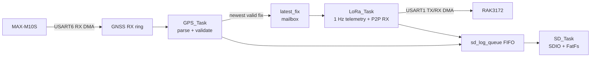

# Nose Cone GNSS & LoRa Telemetry Firmware

Firmware for the nose-cone GNSS receiver, RAK3172 LoRa P2P link, and microSD flight logger.

**Target:** STM32F411RET6 • FreeRTOS • MAX-M10S GNSS • RAK3172 • microSD over SDIO

## Implementation status

The architecture below is the target design; it is not yet fully implemented.
The local branch review on 2026-10-04 found:

| Area | `main` | `Oliver` / current checkout |
| --- | --- | --- |
| Tasks | FreeRTOS heartbeat only | LoRa task and heartbeat; GPS and SD tasks remain unimplemented |
| Radio | No LoRa implementation | USART1 DMA driver, AT parser/builders, P2P state machine, receive rearming, bounded recovery/reset/backoff |
| Telemetry | Planned protocol | Explicit 32-byte serialization, CRC and hex encoding; latest-fix publication API |
| Scheduling | Planned 1 Hz telemetry | Sends when a fix is pending; 1 Hz rate limit and fix-age/validity checks remain unimplemented |
| Ground packets | Planned FIFO/commands | Decodes packets, but FIFO callback is a placeholder that rejects every record; no storage or command execution |
| RF settings | TBD | `main()` passes NULL configuration, so LoRa stays offline until approved settings and TX timeout are supplied |

`inc/gps_structs.h` and `inc/telemetry_frame.h` currently define incompatible
versions of `gps_fix_t` and `telemetry_frame_t`. Reconcile these before GPS
integration; the wire format is produced explicitly by `telemetry_frame_serialize()`.

The merge retains LoRa task startup and FreeRTOS task notifications while
adopting `main`'s CMSIS/startup/linker layout and shell build. The old Windows
Makefile is removed; `build.sh` compiles all LoRa sources and links newlib and
compiler support libraries required by the AT formatter and vendor startup.
These findings concern local branch refs; remote branch freshness was not checked.

## Build and verification

Install the GNU Arm Embedded toolchain (`arm-none-eabi-gcc`, binutils, and
newlib), and initialize the FreeRTOS submodule:

```sh
git submodule update --init rtos
bash build.sh
```

Outputs are `build/firmware.elf`, `.bin`, `.hex`, and `.map`. To build and flash
using an attached ST-Link and installed `st-flash`, run `bash build.sh --flash`.

Run the host tests with a C compiler supporting address and undefined-behavior
sanitizers:

```sh
sh tests/run.sh
```

The merged firmware builds successfully with GNU Arm GCC 14.2.1, producing
23,048 bytes of code/constant data, 88 bytes of initialized RAM data, and
19,920 bytes of zero-initialized RAM data.

Protocol/telemetry, task state-machine, and UART/DMA register tests pass. The
tests use simulated task/hardware interfaces; board operation and over-the-air
behavior still need verification.

## Target system at a glance

The intended firmware has three FreeRTOS tasks. DMA moves UART and SDIO data; interrupts remain short and notify the owning task. Tasks perform parsing, framing, logging, retry, and recovery work.


```mermaid
flowchart LR
    GNSS["MAX-M10S"] -->|"USART6 RX DMA"| GRING["GNSS RX ring"]
    GRING --> GPS["GPS_Task\nparse + validate"]
    GPS -->|"newest valid fix"| FIX["latest_fix\nmailbox"]
    FIX --> LORA["LoRa_Task\n1 Hz telemetry + P2P RX"]
    LORA -->|"USART1 TX/RX DMA"| RAK["RAK3172"]
    GPS --> LOG["sd_log_queue FIFO"]
    LORA --> LOG
    LOG --> SD["SD_Task\nSDIO + FatFs"]
```

| Task        |       Priority | Responsibility                                                                                      |
| ----------- | -------------: | --------------------------------------------------------------------------------------------------- |
| `GPS_Task`  |        Highest | Drain and parse GNSS UART DMA data; publish the newest valid fix; submit GPS log records.           |
| `LoRa_Task` | Second-highest | Send fresh 1 Hz telemetry, service RAK3172 P2P receive/transmit state, and process ground commands. |
| `SD_Task`   |         Medium | Own SDIO/DMA and FatFs; drain the log FIFO.                                                         |

## Core data structures

| Structure          | Flow                               | Policy                                                                                    |
| ------------------ | ---------------------------------- | ----------------------------------------------------------------------------------------- |
| `latest_fix`       | `GPS_Task` → `LoRa_Task`           | Latest-value mailbox. A new fix replaces an older unconsumed fix.                         |
| `sd_log_queue`     | GPS/LoRa → SD                      | FIFO. Preserves log order; count drops if full.                                           |
| GNSS/LoRa RX rings | UART DMA → task                    | Circular byte buffers. ISR snapshots producer position and notifies the task.             |
| `ground_cmd_fifo`  | LoRa parser → LoRa command handler | Small FIFO of complete candidate commands; never use a latest-value mailbox for commands. |

The target radio link sends the newest fresh valid position at **1 Hz**. The intended task is event-driven: it wakes on its 1 Hz deadline, new-fix notification, UART/DMA event, receive-window deadline, or retry timeout. The current implementation wakes on fixes and radio events/timeouts but does not enforce the 1 Hz deadline or freshness policy.

## Key interfaces

| Interface       | Setting                                                          |
| --------------- | ---------------------------------------------------------------- |
| GNSS UART       | USART6, 9,600 bit/s, 8-N-1                                       |
| LoRa UART       | USART1, 115,200 bit/s, 8-N-1                                     |
| Radio mode      | RAK3172 LoRa P2P                                                 |
| Telemetry frame | 32-byte binary `GPS_FIX` frame, then hex encoded for `AT+PSEND=` |
| SD card         | SDIO/SDMMC 4-bit, FatFs                                          |

## Documentation

- [Architecture](docs/architecture.md) — data paths, task behavior, buffers, and scheduling.
- [Hardware interfaces](docs/hardware.md) — pinout and peripheral mapping.
- [Telemetry protocol](docs/protocol.md) — 32-byte frame, serialization, CRC, and commands.
- [Drivers](docs/drivers.md) — UART/DMA and SDIO/FatFs responsibilities.
- [LoRa P2P state machine](docs/lora-state-machine.md) — RAK3172 operation, timing, and receive behavior.
- [Fault handling](docs/fault-handling.md) — startup, degraded operation, and watchdog policy.
- [Test plan](docs/test-plan.md) — bring-up and acceptance checks.

## Important rules

- DMA transfers bytes; interrupts only acknowledge events, snapshot progress, and notify a task.
- No ISR parses NMEA, writes an SD card, transmits a radio command, or waits for hardware.
- A task may block on an RTOS notification, queue, semaphore, or timeout; it must not busy-wait.
- `LoRa_Task` exclusively owns RAK3172 UART buffers and AT-command sequencing.
- `SD_Task` exclusively calls FatFs.
