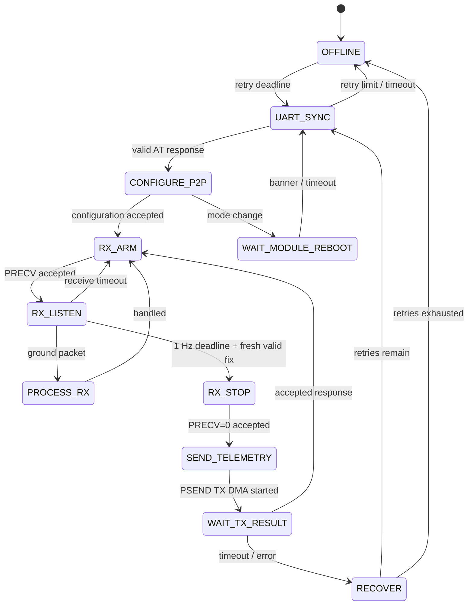

# LoRa P2P State Machine

`LoRa_Task` is the only code permitted to issue RAK3172 AT commands, interpret replies/events, or modify radio UART buffers.

## State rules

- `UART_SYNC`: use bounded `AT`/version probes.
- `CONFIGURE_P2P`: configure only project-approved legal frequency, SF, bandwidth, coding rate, preamble, and power. These parameters remain TBD.
- `RX_ARM`: issue `AT+PRECV=<window>` and wait for acknowledgement.
- `RX_LISTEN`: parse RAK3172 receive events; re-arm after a receive event or timeout.
- `RX_STOP`: issue `AT+PRECV=0` before transmit/reconfiguration, then wait for acknowledgement.
- `SEND_TELEMETRY`: serialize newest fresh fix and issue `AT+PSEND=<hex>` through TX DMA.
- `WAIT_TX_RESULT`: wait for a finite response deadline; success returns to receive, failure proceeds to recovery.
- `RECOVER`: clear parser state, retry sync/configuration, and reset/power-cycle only if supported.

The RAK3172 cannot generally transmit or reconfigure while continuous P2P receive is active. Serialize AT commands, but block on notifications/timeouts rather than busy-wait.
